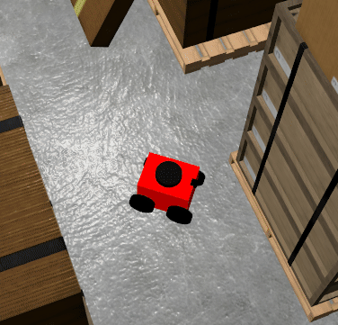

# Mobile Robot Bug2 Navigation System

A ROS 2-based autonomous navigation package that implements the Bug2 path-planning algorithm with a PD wall-following controller in a Gazebo simulation environment.



## Features

- **Bug2 Path Planning**: Navigates along the direct line between the start and goal poses ($M\text{-line}$) and circumnavigates obstacles until intersecting the $M\text{-line}$ closer to the target.
- **PD Wall-Following Controller**: Real-time closed-loop distance control using a proportional-derivative ($K_p = 3.5$, $K_d = 15.0$) controller driven by 2D LiDAR range data.
- **ROS 2 Action Interface**: Full asynchronous goal dispatch, cancellation handling, and continuous feedback reporting (remaining distance to goal) via the `Navigate` action.
- **Three-State Finite State Machine (FSM)**: Robust switching between straight-line pursuit (`STATE_GO_TO_GOAL`), obstacle contouring (`STATE_WALL_FOLLOW`), and final orientation alignment (`STATE_ROTATE_TO_FINAL`).
- **Complete Simulation Pipeline**: Automated XML launch workflow integrating Gazebo Sim depot environment, Xacro-based URDF spawning, and bidirectional communication through `ros_gz_bridge`.
- **Interactive CLI Client**: Dedicated command-line interface with runtime validation for target coordinates within the depot environment bounds ($x \in [-14.0, 14.0]\,\text{m}$, $y \in [-7.0, 7.0]\,\text{m}$).

## Tech Stack

| Component | Technology / Framework |
| :--- | :--- |
| **Robotics Middleware** | ROS 2 (Humble / Iron) |
| **Simulation Engine** | Gazebo Sim (`ros_gz_sim`, `ros_gz_bridge`) |
| **Programming Language** | Python 3 (`rclpy`) |
| **Robot Modeling** | URDF, Xacro, SDF |
| **Core ROS 2 Nodes** | `robot_state_publisher`, `ros_gz_bridge parameter_bridge` |
| **Build System** | `colcon`, CMake, `ament_cmake` / `ament_python` |

## Prerequisites

Ensure the following tools and packages are installed on your system:

- **Ubuntu Linux** (22.04 LTS recommended)
- **ROS 2** (Humble Hawksbill or later)
- **Gazebo Sim** (Fortress or Harmonic) with ROS integration:
  - `ros-<ros2-distro>-ros-gz-sim`
  - `ros-<ros2-distro>-ros-gz-bridge`
  - `ros-<ros2-distro>-robot-state-publisher`
  - `ros-<ros2-distro>-xacro`
- **Python 3** with standard libraries (`math`, `time`)
- **Colcon** build tools and `rosdep`

## Installation and Setup

Follow these exact steps to clone, resolve dependencies, and compile the workspace:

### 1. Clone the Repository

```bash
git clone https://github.com/valentinveselcic/Mobile-Robot-Navigation-System.git.
```

### 2. Install Dependencies
Resolve and install required system and ROS package dependencies:

```bash
cd Mobile-Robot-Navigation-System
sudo apt update
rosdep update
rosdep install --from-paths src --ignore-src -r -y
```

### 3. Build the Workspace
Build all packages using `colcon`:

```bash
colcon build --symlink-install
```

### 4. Source the Environment
Source the workspace overlay in your shell:

```bash
source install/setup.bash
```

## Usage

Operating the navigation pipeline requires running two nodes in separate sourced terminals.

### 1. Launch the Simulation and Action Server

Run the main launch file to start Gazebo Sim, load the depot world, spawn the robot model, initialize the parameter bridge, and start the `navigate_action_server` node:

```bash
ros2 launch robot_bringup sim_mob_rob.launch.xml
```

### 2. Run the Navigation Client

In a second terminal (sourced with the workspace setup script), launch the interactive action client:

```bash
ros2 run robot_navigator navigation_client
```

### 3. Provide Target Coordinates

The client will prompt you for the goal coordinates and orientation within the defined depot workspace limits:

```text
--- Navigation Action Client ---
Enter X [m] (-14.0 to 14.0): 5.0
Enter Y [m] (-7.0 to 7.0): -2.5
Enter Theta [deg]: 90
```

During execution, the client continuously streams progress feedback to stdout:

```text
[INFO] [navigation_action_client]: Sending goal: X=5.0, Y=-2.5, Theta=90
[INFO] [navigation_action_client]: Goal accepted!
[INFO] [navigation_action_client]: Distance to goal: 4.82 m
[INFO] [navigation_action_client]: Distance to goal: 3.10 m
...
[INFO] [navigation_action_client]: Goal reached successfully!
```

## License

This project is licensed under the MIT License.
